```{r setup, include=FALSE}
knitr::opts_chunk$set(
  collapse = TRUE,
  comment = "#>"
)
library(micropoint)
```
<style>
  body {
    text-align: justify;
  }
  
  .col2 {
    columns: 2 200px;         /* number of columns and width in pixels */
    -webkit-columns: 2 200px; /* chrome, safari */
    -moz-columns: 2 200px;    /* firefox */
  }
  
  .leg {
    font-size: 12px;
  }

  img {
    display: block;
    margin-left: auto;
    margin-right: auto;
    max-width: 100%;
    height: auto;
  }

  .figure {
    text-align: center;
    margin: 20px 0;
  }

  .figure img {
    display: inline-block;
    vertical-align: middle;
  }

  .figure figcaption {
    font-size: 12px;
    text-align: center;
  }
</style>
* [Disclaimer](#disclaimer)
* [Overview](#overview)
* [Package install](#package-install)
* [Microclimate model inputs](#microclimate-model-inputs)
  + [Meteorological data](#meteorological-data)
  + [Vegetation parameters](#vegetation-parameters)
  + [Soil parameters](#soil-parameters)
  + [Additional inputs](#additional-inputs)
* [Running the microclimate model](#running-the-microclimate-model)
  + [Vertical profile](#vertical-profile)
  + [Time series](#time-series)
  + [Profile and series](#profile-and-series)
  + [Bare ground](#bare-ground)
* [Microclimate model outputs](#microclimate-model-outputs)
  + [Profile outputs](#profile-outputs)
  + [Time series outputs](#time-series-outputs)
  + [Profile and series outputs](#time-series-outputs)
* [Ecotherm model](#ectotherm-model)
  + [Ecotherm model inputs](#ecotherm-model-inputs)
  + [Ectotherm vertical profile](#ectotherm-vertical-profile)
  + [Ectotherm time series](#ecotherm-time-series)
  + [Ectotherm profile and series](#ecotherm-profile-and-series)
  + [Ectotherms and bare ground](#ectotherms-and-bare-ground)
* [References](#references)
  
## Disclaimer
This version of the package is still under development and is currently distributed only to support a small number of specific research projects in which the package author is directly involved. As the codebase is still evolving, stability and backward compatibility cannot yet be guaranteed.

For this reason, users should be aware that functionality, parameter definitions, and outputs may change without notice. While feedback is welcome, filing bug reports is unlikely to result in fixes at this stage unless they affect the projects for which the package is currently being used.

## Overview
This vignette describes the microclimate model implemented in the micropoint R package. The model represents an advance on earlier versions by improving the representation of soil temperature, soil water dynamics, and plant transpiration.

Like most mechanistic microclimate models, it is based on surface energy balance. The temperature of the ground, canopy, and air layers is determined by the balance between energy gains and losses. Environmental surfaces absorb solar radiation and emit thermal (longwave) radiation, exchange sensible heat with the surrounding air, and experience latent heat fluxes associated with evaporation and plant transpiration. In addition, the ground can store and release heat, influencing temperatures through time.

Because many components of the energy budget depend on temperature, the model calculates temperatures by solving the energy balance equations such that energy inputs and outputs remain in equilibrium.

The system is implemented as a multilayer canopy–soil model, allowing vertical variation in microclimate conditions to be represented. For computational efficiency the core model is written in C++, with an R interface that allows users to configure and run simulations within R.

## Package install
Start by installing the package form Github as follows:

```{r eval=FALSE}
require(devtools)
install_github("ilyamaclean/micropoint")
```
The package has few dependencies, so should be straightforward to install, but you will need a recent version of the `Rcpp` package.

## Microclimate model inputs
Three sets of inputs are required to run the model: (i) a data.frame of hourly meteorological forcing variables representing the macroclimate at the location of interest; (ii) a list of vegetation and (iii) a list of soil and ground-surface parameters. Each set of inputs is described below.

### Meteorological data
The built-in data frame `climdata` provides an example of the meteorological inputs required to run the model:

```{r}
head(climdata)
```

The data frame contains the following columns: `obs_time` (POSIXlt observation time), `temp` (air temperature, °C), `relhum` (relative humidity, %), `pres` (atmospheric pressure, kPa), `swdown` (total shortwave radiation received by a horizontal surface, W m⁻²), `difrad` (diffuse shortwave radiation, W m⁻²), `lwdown` (downward longwave radiation, W m⁻²), `windspeed` (wind speed at reference height, m s⁻¹), `winddir` (wind direction, °), and `precip` (precipitation, mm h⁻¹). All values in `obs_time` must be in UTC (Coordinated Universal Time).

One complication is that meteorological inputs must represent above-canopy conditions, whereas forcing data are often measured 1–2 m above the ground, below the height of surrounding vegetation (e.g. forest canopy). The function `weatherhgt_adjust` can be used to adjusts temperature, humidity, wind speed and pressure to estimate the values that would occur sufficiently high above the surface, assuming site characteristics consistent with WMO guidelines for weather station siting. In the example below, these variables are adjusted to 27m above ground.  


```{r eval=FALSE}
climdata_adj <- weatherhgt_adjust(climdata, zin = 2, zout = 27, 
                                  lat = 49.96807, long = -5.215668)
```

When running the model, the user specifies the height of the meteorological forcing data. If this is below canopy height, the adjustment is applied automatically.

### Vegetation parameters
Vegetation properties are provided to the model as a named list describing canopy structure, leaf optical properties, and physiological controls on transpiration.

Several parameters are associated with the stomatal conductance and photosynthesis model, which follows the hydraulically based optimisation framework of Eller et al. (2020). These parameters control how stomata respond to light, temperature, vapour pressure deficit and plant water status, including the maximum Rubisco carboxylation rate (`Vcmx25`), temperature limits for photosynthesis (`Tlow`, `Tup`), photosynthetic quantum efficiency (`alpha`), vapour pressure deficit sensitivity (`Dcrit`), and hydraulic parameters describing xylem conductance and vulnerability (`Kxmx`, `psi50`, `apsi`, `hv`). Additional parameters specify the ratio of internal to external CO₂ under low vapour pressure deficit (`f0`) and the fraction of carboxylation capacity allocated to dark respiration (`fd`).

Canopy structure is defined by vegetation height (`h`), plant area index (`pai`) and leaf angle parameter (`x`) as described by Campbell (1986). Leaf optical properties (`lref`, `ltra`, `lrefp`, `ltrap`) determine reflection and transmission of shortwave and photosynthetically active radiation within the canopy.

Leaf dimensions (`len`, `wid`) influence convective heat exchange, while vegetation emissivity (`vegem`) controls longwave radiation exchange. The parameter `mwft` specifies the maximum thickness of water films that can accumulate on leaves following rainfall or condensation.

Two parameters link vegetation to the soil water model. The parameter `pTAW` specifies the fraction of total available soil water that can be depleted before water stress occurs, and `rootskew` controls the vertical distribution of roots and therefore how water uptake is distributed through the soil profile.

The easiest way to derive these parameters is to use the inbuilt function
`createvegp`, which automatically generates a list for a given plant function type:

```{r eval=FALSE}
vegp <-  createvegp(vegtype = 'C3')
```

The plant functional types and their default parameter values follow those used in the Joint UK Land Environment Simulator (see Harper et al. 2016). In the example above C3 grass is specified. The function help file lists the other available plant functional types.

Additionally, two vectors must be provided: `paii`, giving the plant area index in each canopy layer (ordered from bottom to top), and `Lfrac`, giving the fraction of plant area in each layer that is living leaf tissue.

At least 10 layers are required for the model to run. Increasing the number of layers improves the representation of vertical gradients in radiation, temperature, and transpiration, but also increases computation time; around 20 layers typically provides a good balance between accuracy and speed.

The values in `paii` must sum to the total plant area index (`pai`) specified in the vegetation parameter list, and the `Lfrac` vector must have the same length as `paii`.

The inbuilt functions `PAIgeometry` (for forest vegetation) and `PAIgrass` (for grassland) are using for generating the `paii` vectors and demonstrated below.

### Soil parameters
Soil properties are provided to the model as a named list describing the hydraulic, thermal and surface characteristics of the soil profile.

Most parameters describe soil hydraulic behaviour following the formulations of Campbell (1985) and the later implementations presented in Bittelli, Campbell & Tomei (2015). These include the volumetric soil water content at saturation (`Smax`), residual water content (`Smin`), a pore-size distribution parameter (`n`), saturated hydraulic conductivity (`Ksat`), and the soil water retention parameters (`b`, `psi_e`). Together these determine how water is stored and moves through the soil.

The physical composition of the soil is described by the volumetric fractions of quartz (`Vq`), other minerals (`Vm`), organic matter (`Vo`), and coarse fragments (`Mc`), together with bulk density (`rho`). These properties influence both hydraulic behaviour and soil thermal properties such as heat capacity and thermal conductivity.

Surface energy exchange also depends on the radiative properties of the ground surface, which are specified through the ground shortwave reflectance (`gref`), ground longwave emissivity (`groundem`), and reflectance for photosynthetically active radiation (`grefPAR`). Terrain effects on radiation can also be represented using the ground surface slope (`slope`) and aspect (`aspect`).

Additional parameters describe the numerical structure of the soil profile used by the model. The argument `nLayers` specifies the number of soil layers in the model, while `totalDepth` gives the depth of the soil column. The logical parameter `deepSaturated` determines whether the lower boundary condition of the soil column is assumed to remain saturated.

The easiest way to generate a consistent set of soil parameters is to use the inbuilt function `createsoilc`, which constructs a soil parameter list for a specified soil texture class:

```{r eval=FALSE}
soilp <- createsoilc(soiltype = "Clay loam", nlayers = 15, totalDepth = 2)
```

Available soil texture classes include sand, loamy sand, sandy loam, loam, silt loam, sandy clay loam, clay loam, silty clay loam, sandy clay, silty clay, and clay.

### Additional inputs
Additionally, `lat` and `long` specify the latitude and longitude of the location in decimal degrees. Optional inputs include `zref`, the height above ground of the supplied meteorological forcing data (2 m by default); `SoilTempIni` and `ThetaIni`, vectors giving the initial soil temperature (°C) and soil water fraction for each soil layer, ordered from the soil surface downward and including the lower boundary node; `maxiter`, the maximum number of iterations allowed for model convergence; `tolerance`, the numerical tolerance used to determine convergence; and `c3`, an optional logical flag indicating whether C3 photosynthesis is assumed.

The final inputs are `zm` - a measure of surface roughness evoked only when the ground surface is bare, and `CO2ppm`, the atmospheric CO₂ concentration (ppm) during the model run. This affects stomatal behaviour and hence evapotranspirative cooling. If not provided (`NA`), the model estimates CO₂ concentration from the simulation year using the function `Cafromyear`, which applies polynomial fits to historical observations and projections for the period 1750–2100 as in the example below.

```{r eval=FALSE}
Cafromyear(1980)
Cafromyear(2030)
```

## Running the microclimate model

### Vertical profile
In the example below we generate and plot vertical microclimate profiles for a specified hour using the return_profile function. The function checks and, if necessary, adjusts the height of the input weather data, runs the full model to the specified hour using 10 layers to initialise the soil heat and water models, and then plots the profile using n canopy layers. We first generate the required input data for a forest. We then return and plot the temperature profiles for the hottest hour. 

```{r eval=FALSE}
# ------------------------- Forest example ----------------------------------- #
n <- 100 # Number of layers
# Create vegetation parameters from habitat type: 
  # BET-Te – Broadleaf Evergreen Tree (Temperate)
vegp <-  createvegp(vegtype = "BET.Te")
paii <- PAIgeometry(vegp$pai, 7, 70, n = n) # pai of each layer
Lfrac <- seq(0.5, 0.85, length.out = length(paii)) # Living vegetation fraction
# Create soil parameters
soilc <- createsoilc(soiltype = "Clay loam")
# Select hottest hour
hr <- which.max(climdata$temp) # hottest hour (4094)
# return and plot profile
mout <- return_profile(climdata, hr, vegp, soilc, paii, Lfrac, lat = 49.96807, 
                       long = -5.215668, varn = "temp")
```

Here the blue line is the soil and air temperature profile. The green line is the temperature of canopy foliage. The model takes a while to run because of need to do height adjustment and to run the model up to the specified hour. One can instead do a pre-adjust on the input weather data. Once done, the `return_profile` if generating profiles for hours early in the time sequence. 

```{r eval=FALSE}
climdata_adj <- weatherhgt_adjust(climdata, zin = 2, zout = 27, 
                                  lat = 49.96807, long = -5.215668)
mout <- return_profile(climdata_adj, hr = 4, vegp, soilc, paii, Lfrac, 
                       lat = 49.96807, long = -5.215668, zref = 27, varn = "temp")
```
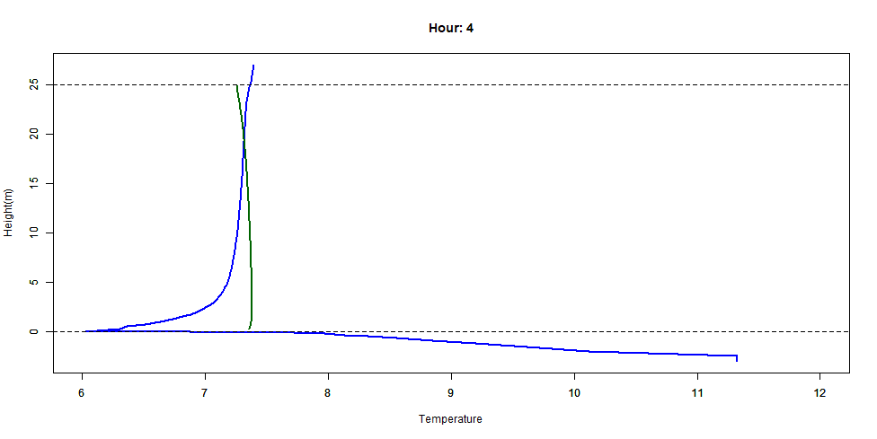
Alternatively we can plot the humidity and radiation profiles

```{r eval=FALSE}
mout <- return_profile(climdata_adj, hr = 13, vegp, soilc, paii, Lfrac, 
                       lat = 49.96807, long = -5.215668, zref = 27, 
                       varn = "relhum")
mout <- return_profile(climdata_adj, hr = 13, vegp, soilc, paii, Lfrac, 
                       lat = 49.96807, long = -5.215668, zref = 27, 
                       varn = "radiation")
```
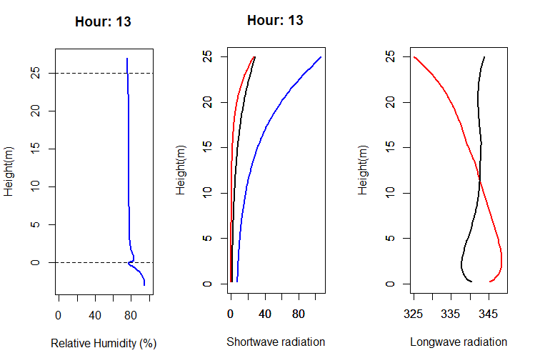
In the left hand relative humidity plot, the soil water content is converted to an effective relative humidity by dividing by the saturated water content (the maximum amount of water that the soil can hold). In the shortwave radiation plot, the blue line is downward diffuse radiation, the red line is downward direct radiation and the black line is the upward stream of shortwave radiation reflected from the ground or leaf surfaces, and assumed entirely diffuse. In the longwave radiation plot, the red is downward longwave and the black line upward longwave. Radiation is measured in Watts per meter squared and the direct stream is the flux density perpendicular to the solar beam. 

We can also produce similar plots for a grass surface:

```{r eval=FALSE}
# ------------------------- Grassland example -------------------------------- 
n <- 20
vegp <-  createvegp(vegtype = "C3") # C3 grassland
vegp$h <- 1 # adjust vegetation height to 1m
paii <- PAIgrass(vegp$h, n, vegp$pai)
Lfrac <- seq(0.9, 1, length.out = length(paii))
par(mfrow =c (1, 2))
mout <- return_profile(climdata, hr = 4094, vegp, soilc, paii, Lfrac, 
                       lat = 49.96807, long = -5.215668, varn = "temp")
mout <- return_profile(climdata, hr = 4094, vegp, soilc, paii, Lfrac, 
                       lat = 49.96807, long = -5.215668, varn = "relhum")
```
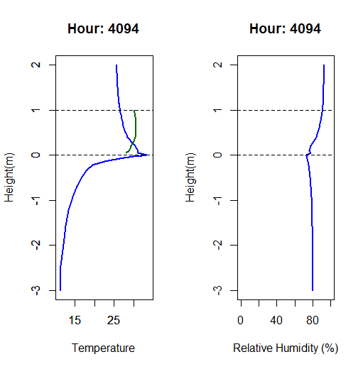

### Time series
To obtain a time series of microclimate conditions at a specified height above or below the ground, use the function `RunMicro`. The argument `reqhgt` specifies the height of interest, with negative values indicating depths below the soil surface. The example below illustrates the function for both forest and grassland.

```{r eval=FALSE}
# ------------------------- Forest example ----------------------------------- #
# NB assumes climdata_adj already created
n <- 20 # Number of layers
# Create vegetation parameters for Broadleaf Evergreen Tree (Temperate) 
vegp <-  createvegp(vegtype = "BET.Te")
paii <- PAIgeometry(vegp$pai, 7, 70, n = n) # pai of each layer
Lfrac <- seq(0.5, 0.85, length.out = length(paii)) # Living vegetation fraction
# Create soil parameters
soilc <- createsoilc(soiltype = "Clay loam")
# Run model for 25 cm above ground and compare to input forcing data
mout <- RunMicro(climdata_adj, reqhgt = 0.25, vegp, soilc, paii, Lfrac, 
                 lat = 49.96807, long = -5.215668, zref = 27)
# Plot results for temperature (grey = macroclimate, red = microclimate)
tme <- as.POSIXct(climdata_adj$obs_time, tz = "UTC")
par(mfrow =c (1, 1))
plot(climdata_adj$temp ~ tme, type = "l", col = rgb(0, 0, 0, 0.5),
     xlab = "Month", ylab = "Temperature", ylim = c(-2, 25))
par(new = TRUE)
plot(mout$tair ~ tme, type = "l", col = rgb(1, 0, 0, 0.5),
     xlab = "", ylab = "", ylim = c(-2, 25))
```
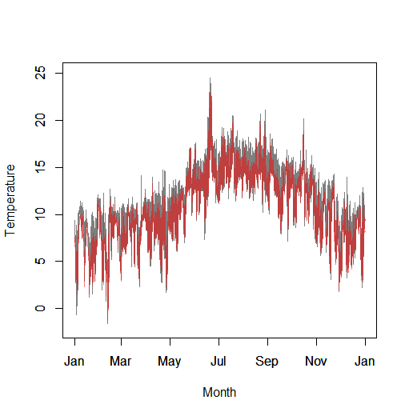

```{r eval=FALSE}
# ------------------------- Grassland example ---------------------------------- #
n <- 20 # Number of layers
# Create vegetation parameters for C3 grassland
vegp <-  createvegp(vegtype = "C3") # C3 grassland
vegp$h <- 1 # adjust vegetation height to 10 cm
vegp$pai <- 0.5 # reduce pai to 0.5
paii <- PAIgrass(vegp$h, n, vegp$pai) # generate foliage profile
Lfrac <- seq(0.9, 1, length.out = length(paii))
# Create soil parameters
soilc <- createsoilc(soiltype = "Clay loam")
# Run model for 5 cm above ground and compare to input forcing data
mout <- RunMicro(climdata, reqhgt = 0.05, vegp, soilc, paii, Lfrac, 
                 lat = 49.96807, long = -5.215668)
# Plot results for temperature
tme <- as.POSIXct(climdata$obs_time, tz = "UTC")
plot(climdata$temp ~ tme, type = "l", col = rgb(0, 0, 0, 0.5),
     xlab = "Month", ylab = "Temperature", ylim = c(-3, 32))
par(new = TRUE)
plot(mout$tair ~ tme, type = "l", col = rgb(1, 0, 0, 0.5),
     xlab = "", ylab = "", ylim = c(-3, 32))
```
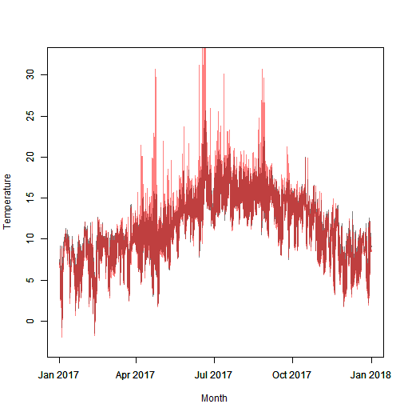

### Profile and series
The final option is to return microlimate outputs for all heights and hours as matrices. We do this using the function `RunModelFull` illustrated below for forest

```{r eval=FALSE}
# ------------------------- Forest example ----------------------------------- #
# NB assumes climdata_adj already created
n <- 20 # Number of layers
# Create vegetation parameters for Broadleaf Evergreen Tree (Temperate) 
vegp <-  createvegp(vegtype = "BET.Te")
paii <- PAIgeometry(vegp$pai, 7, 70, n = n) # pai of each layer
Lfrac <- seq(0.5, 0.85, length.out = length(paii)) # Living vegetation fraction
# Create soil parameters
soilc <- createsoilc(soiltype = "Clay loam")
# Run model for all heights
mout <- RunModelFull(climdata_adj, soilc, vegp, paii, Lfrac, 
                     lat = 49.96807, long = -5.215668, zref = 27)
```

Here `mout` is a list in which each microclimate variable is stored as a matrix. These outputs can be manipulated to produce a continuous time–height plot. The function `expand_output`, supplied with the package, increases the vertical resolution of the profiles using spline interpolation. In the example below the soil temperature profile is appended to the air temperature profile and the combined matrix is interpolated to a finer vertical grid for plotting using the `terra` package.

```{r eval=FALSE}
require(terra)
# Air: transpose so rows are heights, then expand to 2500 pixels (25m)
air <- t(mout$tair)
air <- expand_output(air, 2500)
# Soil: reverse columns first so they run deepest -> surface, then transpose,
# then expand to 300 pixels, then flip so rows run surface -> depth (3m)
soil <- t(mout$tsoil[, ncol(mout$tsoil):1])
soil <- expand_output(soil, 300)
soil <- soil[nrow(soil):1, ]
# Combine so raster rows run from top (25 m) to bottom (-3 m)
temp <- rbind(air[nrow(air):1, ], soil)
# Convert to raster and set extent
temp <- rast(temp)
ext(temp) <- c(0, 8760, -3, 25)
plot(temp, asp = NA)
```
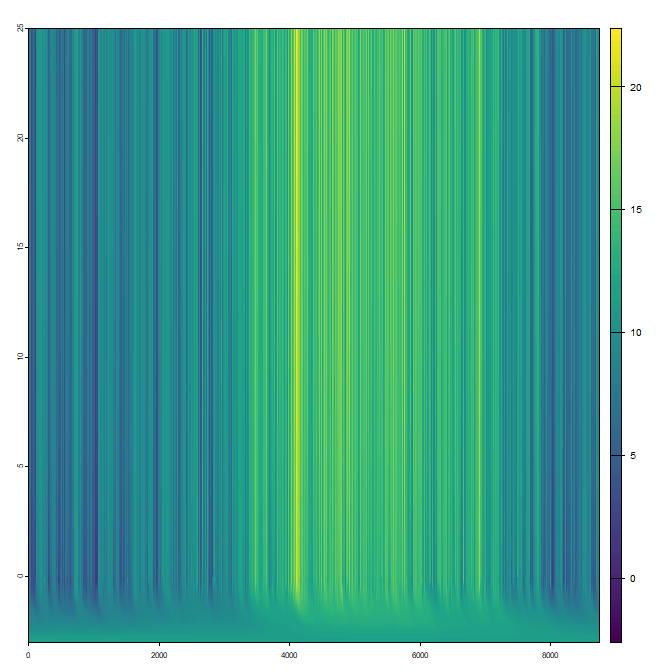

### Bare ground
Running the model for bare ground is straightforward: the same functions are used, but `vegp`, `paii`, and `Lfrac` are set to `NA`. The only parameter requiring particular attention is `zm`, the roughness length for momentum transfer (m) of the soil surface, which reflects how rough the surface is. Typical values range from about 0.0003 for very smooth desert surfaces to 0.002–0.006 for bare tilled soil. As a simple guide, zm is usually around one tenth of the typical height variation of the soil surface (e.g. small clods or ridges).

To plot a profile one simply does:

```{r eval=FALSE}
# Create soil parameters
soilc <- createsoilc(soiltype = "Clay loam")
# Select hottest hour
hr <- which.max(climdata$temp) # hottest hour (4094)
# return and plot profile
mout <- return_profile(climdata, hr, vegp = NA, soilc, paii = NA, Lfrac = NA, 
                       lat = 49.96807, long = -5.215668, varn = "temp")
```
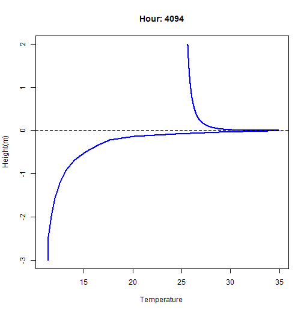

To run the model as a time-series we do

```{r eval=FALSE}
# Create soil parameters
soilc <- createsoilc(soiltype = "Clay loam")
# Run model for 2 cm above ground
mout <- RunMicro(climdata, reqhgt = 0.02, vegp = NA, soilc, paii = NA, Lfrac = NA,
                 lat = 49.96807, long = -5.215668)
# plot temperature time series
tme <- as.POSIXct(climdata$obs_time, tz = "UTC")
plot(climdata$temp ~ tme, type = "l", col = rgb(0, 0, 0, 0.5),
     xlab = "Month", ylab = "Temperature", ylim = c(-3, 32))
par(new = TRUE)
plot(mout$tair ~ tme, type = "l", col = rgb(1, 0, 0, 0.5),
     xlab = "", ylab = "", ylim = c(-3, 32))
```
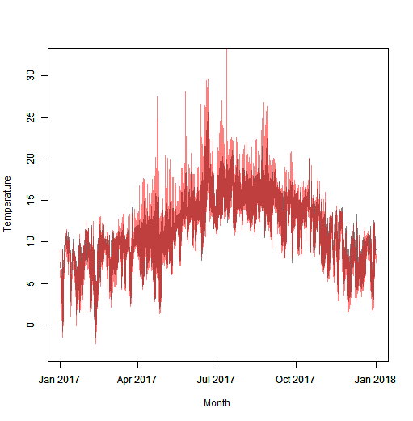
Alternatively we may wish to derive the volumetric soil water fraction near the surface. Here we use the ``InitailizeWater`, which sets up a sensible initial soil water profile.

 
```{r eval=FALSE} 
# Run model for a year to initialize water profile
ThetaIni <- InitailizeWater(climdata, vegp = NA, soilc, 
                            lat = 49.96807, long = -5.215668)
# Run model to generate output
mout <- RunMicro(climdata, reqhgt = -0.001, vegp = NA, soilc, paii = NA, 
                 Lfrac = NA, lat = 49.96807, long = -5.215668, 
                 ThetaIni = ThetaIni)
plot(mout$soilwater ~ tme, type = "l", col = "blue",
     xlab = "Month", ylab = "Soil water") 
```
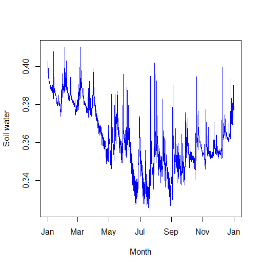

Finally, to return microlimate outputs for all heights and hours as matrices we again use the function `RunModelFull`:

```{r eval=FALSE}
# Run model for all heights
mout <- RunModelFull(climdata, soilc, vegp = NA, paii = NA, Lfrac = NA, 
                     lat = 49.96807, long = -5.215668)
```

## Model outputs
In the examples above only a subset of model outputs are illustrated. The full set of variables returned by the profile functions is described below.

### Profile outputs
The function `return_profile` returns a list describing the vertical microclimate profile for a single hour. The exact contents depend on whether vegetation is present and on the variable being plotted, but the returned object includes the vertical coordinates of the profile together with the corresponding microclimate variables.

For bare ground, the output includes air temperature (`tair`, °C), relative humidity (`rh`, %), soil temperature (`Soiltemp`, °C), soil water content (`thetas`, m^3 m^-3), and the corresponding height and soil-depth coordinates (`z` and `zb`, m).

When vegetation is present, the output also includes canopy and above-canopy profiles. In addition to `tair`, `rh`, `Soiltemp`, `thetas`, `z`, and `zb`, the returned list includes leaf temperature (`tleaf`, °C), shortwave radiation profiles (`Rdirdown`, `Rdifdown`, `Rswup`, W m^-2), longwave radiation profiles (`Rlwdown`, `Rlwup`, W m^-2), and vectors describing conditions above the canopy (`za`, `tair_above`, and `rh_above`).

### Time series outputs
The function `RunMicro` returns a data frame with one row per time step. The columns `year`, `month`, `day`, and `hour` record the simulation time.

For above-ground outputs, both bare-ground and vegetated runs return direct shortwave radiation (`Rdirdown`, W m^-2), diffuse shortwave radiation (`Rdifdown`, W m^-2), upward shortwave radiation (`Rswup`, W m^-2), downward and upward longwave radiation (`Rlwdown` and `Rlwup`, W m^-2), air temperature (`tair`, °C), ground surface temperature (`tground`, °C), relative humidity (`relhum`, %), wind speed (`windspeed`, m s^-1), the total sensible heat flux (`H`, W m^-2), latent heat flux (`L`, W m^-2), and rate fo heat storage by the ground (`G`, W m^-2), the number of iterations required for convergence (`iters`), and the final convergence error (`error`).

When vegetation is present, the output also includes leaf temperature (`tleaf`, °C), soil evaporation (`Evaporation`, W m^-2), and plant transpiration (`Transpiration`, W m^-2).

### Profile and series outputs
The function `RunModelFull` returns a list of numeric matrices describing the simulated microclimate for all time steps and all vertical positions. In each matrix, rows correspond to time steps and columns correspond to canopy heights (above ground) or soil nodes (below ground).

For bare-ground runs, the returned matrices are air temperature (`tair`, °C), relative humidity (`relhum`, %), wind speed (`windspeed`, m s^-1), soil temperature (`tsoil`, °C), and volumetric soil water content (`theta`, m^3 m^-3).

When vegetation is present, the returned list also includes direct shortwave radiation (`Rdirdown`, W m^-2), diffuse shortwave radiation (`Rdifdown`, W m^-2), upward shortwave radiation (`Rswup`, W m^-2), downward longwave radiation (`Rlwdown`, W m^-2), upward longwave radiation (`Rlwup`, W m^-2), air temperature (`tair`, °C), leaf temperature (`tleaf`, °C), relative humidity (`relhum`, %), wind speed (`windspeed`, m s^-1), soil temperature (`tsoil`, °C), and volumetric soil water content (`theta`, m^3 m^-3).

## Ectotherm model
This section of the vignette describes how to run the ectotherm model to estimate body temperature.

### Ecotherm model inputs
Aside from the outputs of the microclimate model, the ectotherm model requires a list of parameters describing the geometry, thermal properties, and physiological characteristics of the organism. These parameters are supplied as a named list.

To aid in generating this list, the function `create_ectop` can be used. This function derives the required parameters from a small set of easily specified inputs describing body size, surface properties, and assumed behavioural posture. Body volume is estimated assuming an ellipsoidal shape and body surface area is calculated using the Knud Thomsen approximation for ellipsoids. Several additional parameters controlling heat exchange and metabolic heat production are assigned default values based on broad physiological assumptions and metabolic scaling relationships.

The inputs to `create_ectop` are the body height (`height`), width (`width`), and length (`len`) in centimetres, which define the overall body geometry. The shortwave reflectance of the body surface (`refl`) determines how much solar radiation is reflected rather than absorbed. The parameter `adir` specifies the orientation of the organism relative to north (in degrees) and is used to determine the angle of incidence of direct solar radiation. The argument `position` describes how the organism is oriented in the environment. This can assume a fixed orientation, random orientation - either with respect to both the direction in which it faces (`randomdir`) or with respect to both direction and vertical tilt (`random`), or behavioural postures that maximise or minimise absorbed radiation. The argument `type` specifies the broad ectotherm group (`"arthropod"`, `"reptile"`, `"amphibian"` or `"other"`), which determines default physiological parameter values.

The function returns a list containing both the supplied inputs and several derived parameters required by the ectotherm model. These include the estimated body volume (`volume`) and surface area (`area`), longwave emissivity (`em`), thermal conductivity of body tissue (`k`), and the fraction of the body surface in conductive contact with the substrate (`confrac`). The parameter `rc` estimates the cutaneous resistance (s/m) which controls evaporative water loss. Values of `rc` for a given ectotherm type can nevertheless vary substantially among species, and may be lower in semi-aquatic taxa, so users may wish to modify the default returned parameter values where more appropriate species-specific information is available. 

The list also includes parameters controlling metabolic heat production. These are defined by the relationship $\small M = a_0 m^b Q_{10}^{(T-T_{ref})/10}$, where `a0` is a normalization constant, `b` is the mass-scaling exponent, `Q10` describes the temperature sensitivity of metabolic rate, and `Tref` is the reference temperature for metabolic scaling.

After generating the parameter list using `create_ectop`, any of the values can be modified if more precise measurements are available for the species or life stage of interest.

In the example below, we generate these parameters for a small Lizard

```{r eval=FALSE} 
ectop <- create_ectop(height = 4, width = 3, len = 8, refl = 0.15, adir = 0, position = "randomdir", type = "reptile")
```

### Ectotherm vertical profile
Each of the ectotherm model functions is designed is designed to match one of the microclimate model functions. Thus, to generate a profile of body temperatures, we just use the outputs from [return_profile()] along with some of the other variables used when running this function:

```{r eval=FALSE} 
# ------------------------- Forest example ----------------------------------- #
# Perform weather height adjustment
climdata_adj <- weatherhgt_adjust(climdata, zin = 2, zout = 27, 
                                  lat = 49.96807, long = -5.215668)
# Create vegetation parameters from Broadleaf Evergreen Tree (Temperate)
n = 100
vegp <-  createvegp(vegtype = "BET.Te")
paii <- PAIgeometry(vegp$pai, 7, 70, n = n) # pai of each layer
Lfrac <- seq(0.5, 0.85, length.out = length(paii)) # Living vegetation fraction
# Create soil parameters
soilc <- createsoilc(soiltype = "Clay loam")
# Select hottest hour
hr <- which.max(climdata$temp) # hottest hour (4094)
# return and plot profile
mout <- return_profile(climdata_adj, hr = hr, vegp, soilc, paii, Lfrac, 
                       lat = 49.96807, long = -5.215668, zref = 27, varn = "temp")
# run ectotherm model using ectotherm variables previously created
ecto_out <- profile_ecto(mout, climdata_adj, hr, vegp, soilc, ectop, 
                         lat = 49.96807, long = -5.215668, zref = 27, 
                         maxiter = 100, tolerance = 1e-2)
# plot profile
plot(z ~ Tbody, data = ecto_out, type = "l", lwd = 2, 
     col = "red", xlab = "Temperature", ylab = "Height (m)")
abline(h = 0, lty = 2)
abline(h = vegp$h, lty = 2)
```
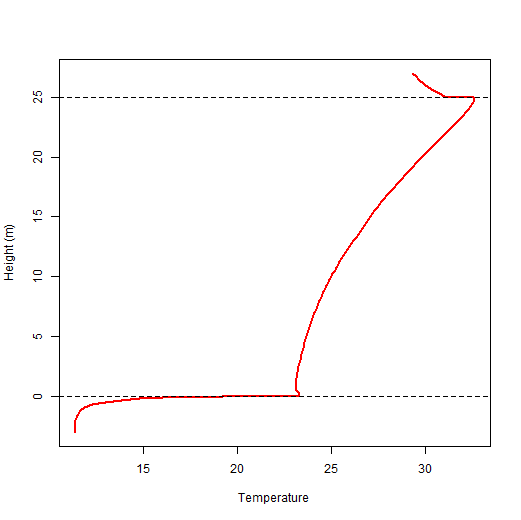

### Ectotherm time series
To generate a time-series of body temperatures, we just use the outputs from [RunMicro()] along with some of the other variables used when running this function:

```{r eval=FALSE} 
# Assume climdata_adj, ectop, vegp and soilc have already bveen created
n = 20
paii <- PAIgeometry(vegp$pai, 7, 70, n = n) # pai of each layer
Lfrac <- seq(0.5, 0.85, length.out = length(paii)) # Living vegetation fraction
# return time series of microclimate 1m above ground
mout <- RunMicro(climdata_adj, reqhgt = 1, vegp, soilc, paii, Lfrac, 
                 lat = 49.96807, long = -5.215668, zref = 27)
# run ectotherm modelwith default maxiter and tolerence
ecto_out <- timeseries_ecto(mout, climdata_adj, reqhgt = 1, vegp,
                            soilc, ectop, lat = 49.96807, 
                            long = -5.215668) 
# Plot results
tme <- as.POSIXct(ecto_out$obs_time)
plot(Tbody ~ tme, data = ecto_out, type = "l", col = "red", 
     xlab = "Month", ylab = "Temperature")
```
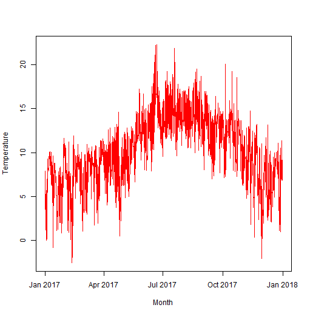
### Ectotherm profile and series
To return values for all hours above and below ground we just use the outputs from [RunModelFull()] along with some of the other variables used when running this function:

```{r eval=FALSE} 
# Run model for all heights and hours assuming inputs already created
mout <- RunModelFull(climdata_adj, soilc, vegp, paii, Lfrac, 
                     lat = 49.96807, long = -5.215668, zref = 27)
# Run ectotherm model with default maxiter and tolerence
ecto_out <- full_ecto(mout, climdata_adj, vegp, soilc, ectop, 
                      lat = 49.96807, long = -5.215668)
```

The function returns a list of two matrices: (1) `Tobodya` - the body temperature for very hour and height above ground, (2) `Tobodyb` - the body temperature for very hour and height below ground, assumed to be the same as the ground temperature. We can then produce a plot, which as we did for microclimate variables (see above)

```{r eval=FALSE} 
require(terra)
# Above ground: transpose so rows are heights, then expand to 2500 pixels (25m)
Tabove <- t(ecto_out$Tbodya)
Tabove <- expand_output(Tabove, 2500)
# Below ground: reverse columns first so they run deepest -> surface, then transpose,
# then expand to 300 pixels, then flip so rows run surface -> depth (3m)
Tbelow <- t(ecto_out$Tbodyb[, ncol(ecto_out$Tbodyb):1])
Tbelow <- expand_output(Tbelow, 300)
Tbelow <- Tbelow[nrow(Tbelow):1, ]
# Combine so raster rows run from top (25 m) to bottom (-3 m)
Tbody <- rbind(Tabove[nrow(Tabove):1, ], Tbelow)
# Convert to raster and set extent
Tbody <- rast(Tbody)
ext(Tbody) <- c(0, 8760, -3, 25)
plot(Tbody, asp = NA)
```
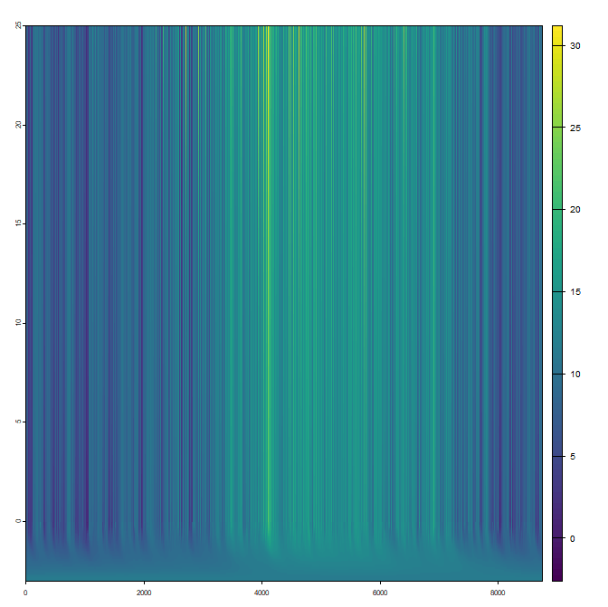

### Ectotherms and bare ground
All three functions for running the ectotherm model automatically handle the situation in which the microclimate model is run above bare ground. So that the functions know when the ectotherm is not in contact with a soilid surface (as is the case when the model is run above ground), `vegp`, as for the microclimate models, is set to `NA` when runing the functions.

One minor and important point is the microclimate model, with `reqhgt = 0` 
does not return wind speed or air temperature. If one wishes to run the ectotherm model for an organism on the ground surface, one should set `reqhgt`
to match the height of the cnetre of the body of the organism, and indeed when
the model is run at any height, the assumed height of climate inputs is not the bottom of the organism. Here we demonstrate how to calculate this from the height and tilt angle of the organism:

```{r eval=FALSE} 
# Create ectotherm inputs
ectop <- create_ectop(height = 4, width = 3, len = 8, refl = 0.15, adir = 0, 
                      position = "randomdir", type = "reptile")
# Calculate hieght above ground of bottm of organism half way a long length
zBtm <-  ectop$len * 0.5 * sin(ectop$atilt * pi / 180) # in cm
# Calculate centre and convert to m
zCtr <- (zBtm + 0.5 * ectop$height) * 0.01 
# Assume sandy soil (more realistic for an ectotherm)
soilc <- createsoilc(soiltype = "Loamy sand")
# Run microclimate model with inbilt climate dataset
mout <- RunMicro(climdata, reqhgt = zCtr, vegp = NA, soilc, paii = NA, Lfrac = NA, 
                 lat = 49.96807, long = -5.215668, zref = 27)
 # Run ecotherm model time-series
ecto_out <- timeseries_ecto(mout, climdata, zCtr, vegp = NA, soilc, ectop, 
                            lat = 49.96807, long = -5.215668)
# Plot time-series
tme <- as.POSIXct(ecto_out$obs_time)
plot(Tbody ~ tme, data = ecto_out, type = "l", col = "red", 
     xlab = "Month", ylab = "Temperature")
```                      
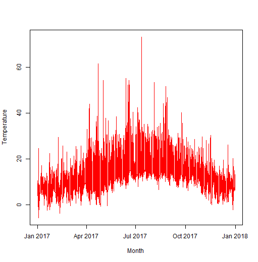
One can see from this plot, that if the ectotherm was forced to sun-bask continuously on bare ground, its body temperature would get excessively hot at times!

## Reference
Bittelli *et al* (2015) *Soil Physics with Python: Transport in the Soil–Plant–Atmosphere System*. Oxford University Press.

Campbell GS (1985) *Soil Physics with BASIC: Transport Models for Soil–Plant Systems*. Elsevier.

Campbell GS (1986) Extinction coefficients for radiation in plant canopies calculated using an ellipsoidal inclination angle distribution. *Agriculture and Forest Meteorology*. https://doi.org/10.1016/0168-1923(86)90010-9

Eller CB *et al*. (2020) Stomatal optimisation based on xylem hydraulics improves land surface model simulation of vegetation responses to climate. *New Phytologist*. https://doi.org/10.1111/nph.16419

Harper AB *et al*. (2016) Improved representation of plant functional types and physiology in the Joint UK Land Environment Simulator (JULES v4.2) using plant trait information. *Geoscientific Model Development*. https://doi.org/10.5194/gmd-9-2415-2016
