```{r, include = FALSE}
knitr::opts_chunk$set(
  collapse = TRUE,
  comment = "#>"
)
```
* [Overview](#overview)
* [Quick start](#quick-start)
* [Model inputs](#model-inputs)
  + [Meteorological data](#meteorological-data)
  + [Vegetation parameters](#vegetation-parameters)
  + [Ground parameters](#ground-parameters)
  + [Additional parameters](#additional-parameters)
* [Model overview](#model-overview)
* [Big-leaf model](#big-leaf-model)
  + [Radiation](#radiation)
  + [Sensible and latent heat](#sensible-and-latent-heat)
  + [Ground heat](#ground-heat)
  + [Soil moisture](#soil-moisture)
* [Below canopy model](#below-canopy-model)
* [Above canopy model](#above-canopy-model)
* [Below-ground model](#above-canopy-model)
* [Model outputs](#model-outputs)
  + [Above canopy](#above-canopy)
  + [Below canopy](#below-canopy)
  + [Ground surface](#ground-surface)
  + [Below ground](#below-ground)
* [Snow](#snow)

## Overview
This vignette describes the R package ‘micropoint’. The package contains a series of functions for modelling above and below canopy or below-ground microclimatic conditions at point locations, providing outputs as a time-series.

In line with standard approaches for mechanistic microclimate modelling, the model is founded on the principles of energy conservation: it is assumed that energy cannot be destroyed or created through ordinary means. Opaque surfaces in the environment, namely the canopy and the ground, absorb radiation from the sun, but also emit radiation as thermal energy. These surfaces also exchange sensible heat with the surrounding air and undergo latent heat fluxes, namely evaporative and evapotranspirative cooling. Some of the energy is also stored or released by the ground. Because the various components of the energy budget have a dependence on temperature, the temperature of the environment is calculated by assuming that energy budget always remain in balance. However, because of inter-dependencies, e.g. between the degree of surface heating and the exchange of sensible heat, and the temperature of the ground surface and the rate of storage by the ground, a closed-form mathematical solution to the energy budget equations cannot be derived. Rather the model must be solved iteratively, which is computational expensive. For this reason the bulk of the model is written using c++. The package contains a series of R wrapper functions for calling the underlying c++ code. 

## Quick start
In this section brief instructions for running the `micropoint` model are provided. The rest of the vignette is devoted to providing more in-depth instruction. Three sets of input variables are needed: (1) a dataset of hourly weather, (2) a dataset of vegetation parameters and (3) a dataset of soil and ground surface properties. The datasets should have the same format and units as the example datasets included with the package and more details on these is provided below. 

In the code below, the point microclimate model is used to derive microclimate estimates one meter above ground for a 10m tall forest canopy using the default inputs and inbuilt datasets. Air temperature (red) is plotted, but the model returns a wider range of outputs (see below). 

```{r eval=FALSE}
library(micropoint)
mout <- runpointmodel(climdata, reqhgt = 1, forestparams, paii = NA,  groundparams, lat =49.96807, long= -5.215668)
tme <- as.POSIXct(climdata$obs_time)
plot(mout$tair ~ tme, type="l", xlab = "Month", ylab = "Air emperature",
     ylim = c(-5, 30), col = "red")
par(new = TRUE)
plot(climdata$temp ~ tme, type="l", xlab = "", ylab = "",
     ylim = c(-5, 30), col = rgb(0, 0, 0, 0.5))
```
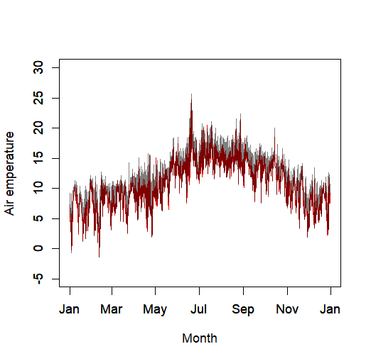

Overall, air temperature below canopy (red line) tracks reference air temperature quite closely (grey line), but there are a few instances where temperatures gets a bit hotter. These are normally instances where wind speed is low and downward solar radiation is particularly high. We show this below. Here the hour of the maximum temperature anomaly is calculated and the radiation and wind speed of that hour are displayed on frequency histograms of radiation and wind speed of all hours. The vertical temperature profile is then plotted using the inbuilt function for doing so. 

```{r eval=FALSE}
# Inspect radiation and radiation at time of greatest temperature anomaly
anom <- mout$tair - climdata$temp
hr <- which.max(anom)
par(mfrow = c(2, 1))
hist(climdata$swdown, main = "", xlab = "Downward shortwave radiation")
abline(v = climdata$swdown[hr], col = "red")
hist(climdata$windspeed, main = "", xlab = "Wind speed")
abline(v = climdata$windspeed[hr], col = "red")
# plot vertical temperature profile for that hour
par(mfrow = c(1, 1))
out <- plotprofile(climdata, hr = hr, "tair", forestparams, paii = NA, groundparams, lat =49.96807, long= -5.215668)
```
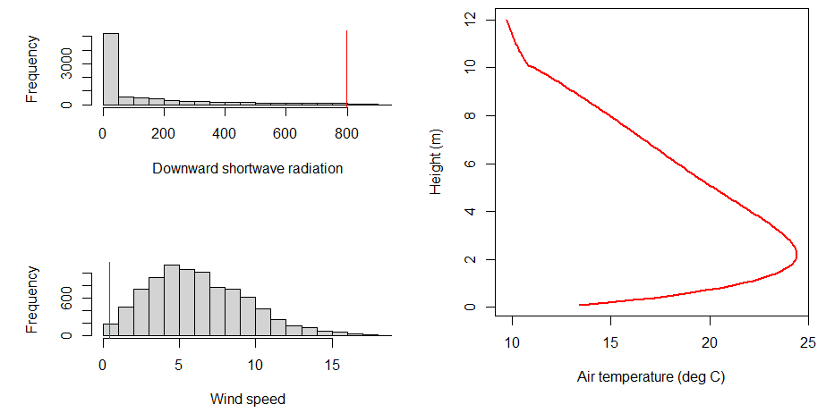

## Model inputs
Three sets of parameters are needed to run the model: (i) a data.frame of standard hourly meterological climate-forcing variables representative of macroclimatic conditions at the location for which the point model is to be run; (ii) a list of parameters describing properties of the canopy;  (iii) a list of parameters describing properties of the soil and ground surface.

Each set of parameters is described in turn. 

### Meteorological data
The inbuilt data,frame `climdata` gives an example of the meteorological variables needed to run the model:

```{r}
head(micropoint::climdata)
```

The data frame contains the following columns: `obs_time` – POSIXlt object of observation times for each climate variable, `temp` – temperatures ($\small^\circ$C), `relhum` - relative humidity (%), `pres` - atmospheric pressure ($\small kPa$), `swdown` - total shortwave radiation received by a horizontal surface ($\small Wm^{-2}$), `difrad` - diffuse radiation ($\small Wm^{-2}$), `lwdown` downward longwave radiation ($\small Wm^{-2}$), `windspeed` - wind speed at reference height ($\small ms^{-1}$), `winddir` - wind direction ($\small ^\circ$) and `precip` - precipitation ($\small mm/hour$). However, as the inbuilt soil moisture model runs in daily time-steps, it is fine to provide identical hourly values in any given  day - i.e. if only daily precipitation is known, just set hourly values to daily values / 24.

**Importantly, the entries of obs_time must all be in UTC (Coordinated Universal Time).** 

Any input weather dataset provided must use the same format, column names and units as in this example dataset. Most of these are standard meteorology variables that are readily available globally. If unknown for the study area, users may wish to explore the `mcera5` package on github (https://github.com/dklinges9/mcera5) 

One complication is that for microclimate modelling, the reference climate data provided in `climdata` need to represent conditions above canopy, yet weather stations typically take readings 1-2m above ground. This is lower than the height of many forest canopies. As  vertical profiles in temperature, humidity and wind speed are related to the nature of the underlying vegetation surface, the vertical profile above a weather station will not necessarily be  the same as over the area of interest. To circumvent this issue, if necessary, the model estimates what temperature, humidity, wind speed and pressure would be measured by a weather station if located a sufficient height above ground. It achieves this by assuming surface properties consistent with WMO guidelines for locating weather stations. These adjustments can be made using function `weather_hgt` as in the example below, but are implemented automatically when running the model.

```{r eval=FALSE}
climdata<-micropoint::climdata # use inbuilt dataset
weather<-weather_hgt(climdata, zin = 2, uzin = 2, zout = 10, lat = 49.96807, long = -5.215668)
par(mfrow=c(1, 3))
# Temperature comparison
plot(weather$temp ~ climdata$temp, xlab = "Temperature at 2 m",
     ylab = "Temperature at 10m", pch = 15)
abline(a = 0, b = 1, lwd = 2, col = "red")
# Relative humidity comparison
plot(weather$relhum ~ climdata$relhum, xlab = "Relative humidity at 2 m",
     ylab = "Relative humidity at 10m", pch = 15)
abline(a = 0, b = 1, lwd = 2, col = "red")
# Wind speed comparison
plot(weather$windspeed ~ climdata$windspeed, xlab = "Wind speed at 2 m",
     ylab = "Wind speed at 10m", pch = 15)
abline(a = 0, b = 1, lwd = 2, col = "red")
```
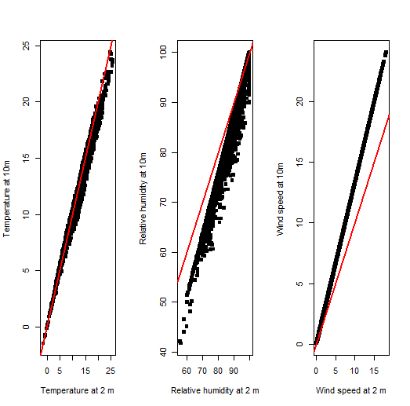

### Vegetation parameters
The inbuilt datasets `vegparams` and `forestparams` gives examples of the vegetation parameters needed to run the model. These are as follows:`h` - canopy height (m), `pai` the total one side plant area for the canopy per unit ground area, `x` - leaf inclination angle coefficient (see below), `clump` - a canopy clumping coefficient representing the fraction of the canopy that is unobscured by vegetation when the sun is at its zenith (0-1), `lref` - leaf reluctance of shortwave radiation (0-1) `ltra` - leaf transmittance of shortwave radiation (0-1), `leafd` - the diameter of leaves averaged over both the length and width of leaves, em` - emissivity of vegetation (0-1), `gsmax` - maximum stomatal conductance (mol / m^2 / s) and `q50` - a coefficient controlling how sensitive stomatal conductance is to photosynthetically active radiation.

Additionally, for below canopy modelling of microclimate, estimates of the vertical distribution of `pai` must be known. This can either be provided as a vector of values `paii` whereby the canopy is divided into `n` layers and each element `i` of `paii` represents the plant area index within a layer at
height `(i / n) * h` where `n` is the total number of layers and `h` is canopy
height. If `paii` is not supplied, `vegp` must contain entries for `skew` and
`spread` as in the example dataset `forestparams` and used by function `PAIgeomtry`, which is used to generate a plausible vector of `paii` values. Note that `sum(paii)` is assumed  to equal `vegp$pai`- the total leaf area of the canopy.

Below is an example of how `paii` can be generated using `PAIgeomtry`.

```{r}
library(micropoint)
paii <- PAIgeometry(PAI = 5, skew = 7, spread = 70, n = 100)
z <- c(1:100) / 10
# plant area within each layer
plot(z ~ paii, type = "l", main = paste("Total PAI:", sum(paii)))
```

Several of these vegetation parameters may be unknown, in which case reasonable estimates must be derived. Users will typically know the height of the canopy and width of leaves in the canopy. The plant atrea index may not be known, but can be approximately derived from canopy cover since:

\begin{equation}
1-C_{f}=\exp(-P_{AI})
\end{equation}

such that 

\begin{equation}
P_{AI}=-\ln(1-C_{f})
\end{equation}

where $\small C_{f}$ is fractional canopy cover and $\small P_{AI}$ is the plant area index. The coefficient `x` represents how vertically or horizontally the leaves of the canopy are orientated and controls how much direct radiation is transmitted through the canopy at a given solar angle (when the sun is low above the horizon, less radiation is transmitted through vertically orientated leaves). Users may refer to Campbell (1986) Agric For Meteorol, 36: 317-321 for a detailed explanation. Perfectly vertically orientated leaves have a Value of zero and horizontally orientated leaves a value of infinity. Deciduous woodlands have values typically around 1, meaning leaves inclinations follow an approximately spherical distribution. Canopy clumping will typically be unknown, but low values in the range 0 to 0.2 are plausible. Leaf reflectance values will likely be unknown, but typical values are 0.8 for photosynthetically active radiation and 0.2 for near-infrared radiation, giving an average of ~0.5 across the shortwave spectrum. Leaf transmission is normally around half the value fo leaf reflectance, and importantly leaf transmittance + reflectance cannot exceed 1. The emissivity of vegetation is always close to 1 and values of 0.97 are typical. Maximum stomatal conductance represents the stomatla conductance of leaves under ample light and water availability. Values typically range from 0.23 for deciduous broadleaf forest to 0.55 for wetland vegetation. Körner (1995) https://link.springer.com/chapter/10.1007/978-3-642-79354-7_22 gives values for major vegetation types of the world. The units of measurement are mol / m^2 / s and the values represent those for individual leaves rather than the bulk surface conductance for the canopy as a whole. The conversion from conductivity $\small K$ measured in m/s or resistance $\small R=1/K$ measured in s/m  is $\small g_{max}=K/\hat{\rho}$ where $\small \hat{\rho}\approx43$. A detailed explanation of the the derivation of `q50` is provided in Kelliher et al (1995) Agric For Meteorol, 73: 1-16. In the absence of better information, the default value of 100 is appropriate. 

### Ground parameters
The inbuilt dataset `groundparams` gives an example of the ground parameters needed to run the model. These are as follows: `gref` - ground reflectance (0-1), `slope` - the slope of the gorund surface (decimal degrees from horizontal), `aspect` - the aspect of the ground surface (decimal degrees from north), `em` the emissivity of the ground surface (0-1), `rho` - the Soil bulk density (Mg / m^3), `Vm` - the Volumetric mineral fraction of soil (0-1), `Vq` - the volumetric quartz fraction of soil (0-1), `Mc` - the mass fraction of clay (0-1), `b` - a Shape parameter for Campbell soil moisture model, `Psie`- matric potential of the soil (J / m^3), `Smax` - the volumetric water content of soil at saturation, `Smin` - the residual water content of soil, `alpha` - a shape parameter of the van Genuchten model (cm^-1), `n` - pore size distribution parameter for the soil and `Ksat` - the saturated hydraulic conductivity of the soil (cm / day).

Further details of the soil parameters are provided in Campbell, G.S.(1985) Soil physics with BASIC: transport models for soil-plant systems. Elsevier and in Van Genuchten, M.T., 1980. A closed‐form equation for predicting the hydraulic conductivity of unsaturated soils. Soil science society of America journal, 44: 892-898. Typical values for different soil types are provided in the inbuilt table `soilparams`:

```{r}
micropoint::soilparams
```

### Additional parameters
Additionally the following parameters must be or can optionally be provided. These are as follows: `reqhgt` - the  height (m) above or below ground for which microclimate outputs are wanted (negative values indicate below ground), `lat` - latitude (decimal degrees, negative south of the equator), `long` - longitude (decimal degrees - negative west of Greenwich meridian), `zref` the height above ground at which reference temperature, wind speed and pressure in `climdata` were derived (see below), `soilm` - optionally a vector representing the fractional soil moisture values in the upper 10 cm of the soil in each hour. If not supplied, the simple inbuilt soil moisture model is used. `surfwet` - optionally - a vector fraction of the canopy surface acting like a freely evaporating water surface in each hour. Should be lower than one under drought conditions. Estimated if not supplied. `dTmx` maximum amount (degrees C) by which the vegetation heat exchange surface of the canopy can exceed air temperature (used to ensure model convergence in the Bigleaf model - see below). `maxiter` - maximum number of iterations over which to run the model to ensure convergence (higher values = slower, but more accurate), `n` - number of layers into which to divide the canopy when running the below canopy model. Taken as `length(paii)` if 'paii' values are provided. Again higher values = slower, but more accurate.

## Model overview
Though run with a single function, internally the model is run in three stages, the latter two with sub-components. These stages can also be run separately. Firstly, the input climate data is automatically height-adjusted to represent conditions above canopy using function [weather_hgt()]. Secondly, a 'Bigleaf' model is run. In essence, this treats the vegetated surface as a single vertically-homogeneous layer of phytomass and allows the energy balance of the vegetated surface to be computed, The BIgleaf model returns various variables that are necessary precursors to running subsequent components of the model. The two-most important are (i) the ground surface temperature and (ii) the temperature of the heat exchange surface of the canopy - in essence a proxy for (though conceptually not entirely consistent with) the average canopy temperature. The model then has three pathways, depending on the height at which user outputs are needed: (i) a multi-layer below-canopy or 'Smallleaf' model used for calculating microclimatic conditions below canopy, (ii) an above canopy model uses for deriving microclimate above canopies or (iii) a below-ground model, used for deriving sub-surface conditions. The entire model workflow is implemented using runmodel as in the example below:

```{r eval=FALSE}
library(micropoint)
# generate typical paii profile for a grass surface 
# canopy divided into n = 10 layers:
paii <- PAIgeometry(PAI = 1, skew = 4, spread = 70, n = 10)
# run model for height mid-way to canopy top (6 cm above ground)
mout1 <- runpointmodel(climdata, reqhgt = 0.06, vegparams, paii,  groundparams, lat = 49.96807, long = -5.215668)
# run model for height 6 cm above canopy (18 cm above ground)
mout2 <- runpointmodel(climdata, reqhgt = 0.18, vegparams, paii,  groundparams, lat =49.96807, long= -5.215668)
tme <- as.POSIXct(climdata$obs_time)
par(mfrow = c(1, 1))
plot(mout1$tair ~ tme, type="l", xlab = "Month", ylab = "Air emperature",
     ylim = c(-5, 45), col = rgb(1, 0, 0, 0.5))
par(new = TRUE)
plot(mout2$tair ~ tme, type="l", xlab = "", ylab = "",
     ylim = c(-5, 45), col = rgb(0, 0, 1, 0.5))
```
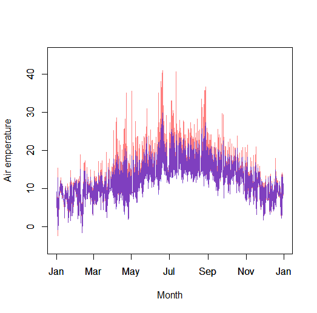
Users also have a convenient wrapper function that can be used, for any given hour, to plot the vertical distribution of air temperature, leaf temperature,  relative humidity or vapour pressure within the canopy as illustrated below.

```{r eval=FALSE}
# identify hottest hour
hr <- which.max(climdata$temp)
# plot profile for air temperature for hottest hour 
# inbuilt vegetation parameters for a forest used (paii estimated automatically)
par(mfrow=c(1, 2))
xx <- plotprofile(climdata, hr = 4091, plotout = "tair", forestparams, paii = NA, groundparams, lat =49.96807, long= -5.215668)
# plot profile for leaf temperature for hr 4091
xx <- plotprofile(climdata, hr = 4091, plotout = "tleaf", forestparams, paii = NA, groundparams, lat =49.96807, long= -5.215668)
```
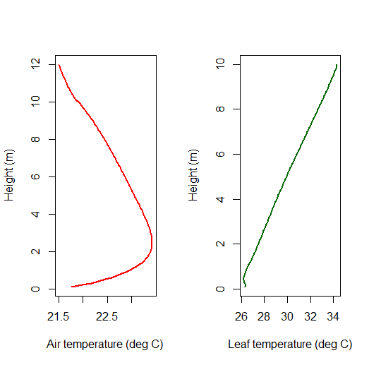

## Big-leaf model
The bigleaf model takes as inputs the same set of parameters as are used for running the entire microclimate  model, but with the distinction that only the total plant area index of the canopy is needed rather than individual estimates for each canopy layer. It is used primarily to derive the canopy heat echange surface and ground surface temperatures as in the example below:

```{r eval=FALSE}
bigleafp <- RunBigLeaf(climdata, vegparams, groundparams,
                       lat = 49.96807, long = -5.215668)
# Plot ground and canopy temperature
tme <- as.POSIXct(climdata$obs_time, tz = "UTC")
par(mar = c(6, 6, 3, 3), mfrow = c(1, 1))
# Ground temperature
plot(bigleafp$Tg ~ tme, type = "l", cex.axis = 2, cex.lab = 2,
     xlab = "Month", ylab = "Temperature", ylim = c(-5, 40),
     col = rgb(1, 0, 0, 0.5))
par(new = TRUE)
# Canopy temperature
plot(bigleafp$Tc ~ tme, type = "l", cex.axis = 2, cex.lab = 2,
     xlab = "", ylab = "", ylim = c(-5, 40), col = rgb(0, 0.5, 0, 0.5))
```
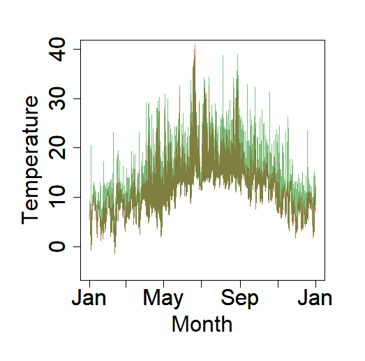

However, as can be seen by inspecting the attributes of the model there are several further outputs provided, for which a brief description is provided here. Though rarely needed in their own right, they are used for subsequent modelling of below and above canopy microclimate, and also used by the microclimf package - a computationally efficient grid version of this model. A full explanation of these outputs is beyond the scope of this vignette - users are referred instead to the vignette in which a detailed description and equations for the models are provided. 

```{r eval=FALSE}
attributes(bigleafp)
```

In addition to canopy (`Tc`) and ground surface (`Tg`) temperature, the following attributes are returned: `H` - the sensible heat flux between thre canopy and the air at reference height (W/m^2), `G` - ground heat flux (W/m^2), `psih` and `psim`  - diabatic correction factors for heat and momentum respectively, `phih` - the diabatic influencing factor for heat and `OL` - the Obukhov Length. These are all measures of atmospheric stability and important for determining the shape of the temperature, humidity and wind profiles above canopy. The coefficient `uf` is the wind friction velocity - important for determining the shape of the wind profile. `RabsG` the flux density of radiation absorbed by the ground surface (including longwave radiation) and `albedo` is the calculated albedo of the canopy, which depends on solar inclination angles. The model is run iteratively to convergence, the a maximum number of iterations set by the user (in the above code, the default 20 is used). The coefficient `err` is the maximum temperature error in any given hour between the ultimate and penultimate iteration of model in instances where the model reaches the maximum number of iterations before converging. Increasing `maxiter` will decrease this value, but at the cost of computational speed.

Individual components of the big-leaf model are described briefly.

### Radiation
The starting point for the big-leaf model is to estimate the flux density of radiation absorbed by the canopy and ground surface. A variant of the 
Dickenson-Sellers two-stream approximation model (Sellers 1985 *Int. J. Remote Sens.* 6: 1335–1372) as described in  Yuan *et al*. (2017) *J Adv Model Earth Sys* 9: 113-29 is used but with the following augmentations. First the model accommodates sloped ground surfaces beneath the canopy. Second the model allows for a none-random distribution of leaf foliage with radiation penetrating directly through larger canopy gaps. Largely, the more elegant means of calculation of absorption and transmission of direct solar radiation as a function of leaf inclination angles proposed by Campbell (1986) *Agri Forest Meteorol* 36: 317-321 is used. As the calculation of absorbed radiation aslso depends on downward longwave radiation, which in turn depends on canopy temperature, the function is embedded in the iterative C++ workflow. However, the hard work is done by function [twostreamparams()], which derives the parameters of the two-stream model/, and R verison of which is included with the package. An illustration of how these parameters are used ot calculate albedo is provided below, though users are referred to Yuan *et al* or to https://rpubs.com/ilyamaclean/1107820 for a full explanation. 

```{r eval=FALSE}
# Run two-stream model with inbuilt datasets
tme <- as.POSIXlt(climdata$obs_time, tz="UTC")
# POSIXlt object used in place of year:
solar <- solarposition(49.96807, -5.215668, year=tme)
twostreamp <- twostreamparams(vegparams, groundparams, solar)
# Calculate `white-sky' albedo (Bi-Hemispherical Reflectance) 
cl <- vegparams$clump
Kc <- with(twostreamp, kkd$kd / kkd$k0)
albd <- with(twostreamp, p1 + p2 + cl^2 * groundparams$gref)
# and `black-sky` albedo (Directional Hemispherical Reflectance) 
albb <- with(twostreamp, p5 / sig + p6 + p7 + cl^Kc * gref2)
# Calculate and plot blue-sky albedo
Rbeam <- with(climdata,(swdown - difrad)) / cos(solar$zen * pi / 180)
alb <- with(climdata, (albd * difrad + albb * Rbeam) / (swdown + Rbeam))
# Set blue-sky albedo to be white-sky albedo when direct radiation is zero
dni<-with(climdata, swdown - difrad)
alb[dni == 0] <- albd
par(mar = c(6, 6, 3, 3))
plot(alb ~ as.POSIXct(tme), type="l", cex.axis = 2, cex.lab = 2,
     xlab = "Month", ylab = "Albedo", ylim = c(0, 1))
```
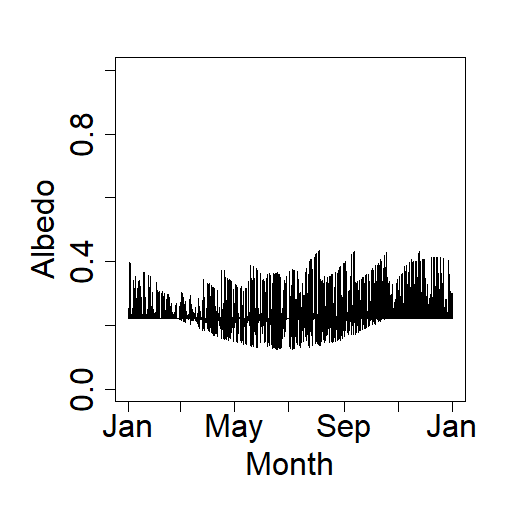
A component of the radiation absorbed by the ground and canopy are re-emitted as thermal radiation, but the remainder is partitioned between ground heat storage and latent and sensible heat, and it is ultimately the balance between these three fluxes that determines the temperature of the canopy and ground surface. What follows is a brief explanation of how these are handled.

### Sensible and latent heat
The net flux of radiation not used up in ground storage is partitioned between sensible and latent heat, the former the exchange of heat between the canopy (or ground) and the air above it, the latter the 'hidden' energy used when e.g. the canopy evapotranspirates. The sensible heat flux is controlled partially by the temperature difference between the canopy and air above it, and indeed it is by re-arranging the energy balance equation to solve for temperature, using the Pemnman-Monteith equation, that the temperature of the canopy surface is derived. A secondary control is the convective conductance between the canopy (or ground) surface and the air above it, which depends both on wind speed and ground surface properties - namely vegetation height and the plant area index - the primary reason why these parameters are required as model inputs. The method implemented by `micropoint` follows Raupach (1994) *Boundary-Layer Met* 71: 211-216 with the corrections for atmospheric instability proposed by Harman & Finnigen (2007) *Boundary-Layer Met* 123: 39–363. 

The latent heat flux is controlled partially by the vapour pressure difference between the canopy and air above it, contingent on both canopy temperature and the vapour pressure of the air. The model takes relative humidity instead of vapour pressure as a model input primarily as this variable is usually more widely available, though the conversion from one to the other is trivial. The exhange of latent heat, in addition to being determined by the the convective conductance between the canopy and the air is also contingent on the bulk surface stomatal conductance of the canopy. Following Kelliher *et al* (1996) *Agri Forest Meteorol* 73: 1-16, it is assumed that stomatal conductance varies as a function of user-specified maximum in response to solar radiation in a manner controlled by the input parameter `q50`, which specifies the densitivity to radiation.  Users are referred to Kelliher *et al* for further details

### Ground heat
A full heat flux model requires the division of the ground into a series of layers with the flux and storage calculated within each layer by solving a set of simultaneous equations. While such a model is planned for future versions of this package, the simpler model proposed in books by de Vries & van Wijk (1963) *Physics of plant environment* and Campbell & Norman (2012) *Environmental Biophysics* is followed. Here the soil is assumed to have vertically uniform thermal properties and follow an approximately sinusoidal diurnal and annual cycle in surface temperature. The ground flux is then assumed to follow a similar sinusoidal cycle but with a 1/4 cycle phase shift. In addition to the amplitude of the surface temperature cycles, the amplitude of the ground heat flux is determined by soil physical properties including water content. However, because of the inter-dependence between soil surface temperature and ground heat flux, a solution must be found iteratively and is embedded in the c++ workflow. However, the function [GFlux()] is a stand-alone R version of the relevant component of the model and its use is illustrated below:

```{r eval=FALSE}
bigleafp <- RunBigLeaf(climdata, vegparams, groundparams,
                       lat = 49.96807, long = -5.215668)
soilm<-soilmmodel(climdata, "Loam")
# Here soil moisture is held constant:                       
G<-GFlux(bigleafp$Tg, soilm, groundparams$rho, groundparams$Vm, groundparams$Vq, groundparams$Mc)
# Plot temperature and G flux on 20th June
tme <- as.POSIXlt(climdata$obs_time)
s <- which(tme$mon+1 == 6 & tme$mday == 20)
par(mfrow=c(2,1))
plot(bigleafp$Tg[s], type = "l", xlab = "Hour", ylab = "Temperature")
abline (v = 12, col = "red")
plot(G$G[s], type = "l", xlab = "Hour", ylab = "Ground heat flux")
abline (v = 12, col = "red")
```
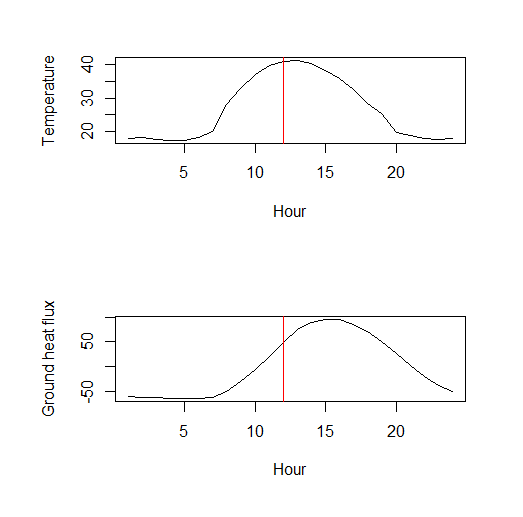
Note the ~3 hour phase shift between the peak in the timing of ground heat flux and the timing of peak air temperatures (here a positive heat flux indicates a flow from the ground to the air). It is the phase shift that causes the delay in the timing of maximum near-ground air temperatures to occur after solar noon. Some of the solar energy is stored in the ground and warms hte air above the ground in the afternoon and evening. Close to dawn, the opposite occurs. 

### Soil moisture
Observant readers may have noted the function [soilmmodel()] in the code above. This implements a simple two-soil layer bucket model that approximates a more complex multi-layer soil model relatively well. This is needed as the heat storage capacity and thermal conductivity of soil is contingent on the fractional soil water content. It is also a useful output in its own right, and returned by the full model if users request that the model us run below the ground surface. An example output is given below:

```{r eval=FALSE}
soilm<-soilmmodel(climdata, "Loam")
tme <- as.POSIXct(climdata$obs_time)
par(mfrow = c(1, 1))
plot(soilm ~ tme, type = "l", col = "blue", xlab = "Month", ylab = "Fractional soil water content")
```
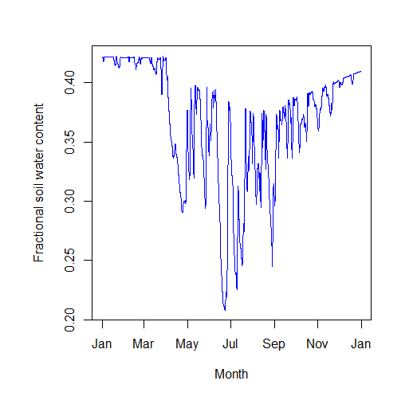

## Below canopy model
The below canopy, or msall-leaf model is based on Raupach's localised near-field model (Raupach 1989 *Q J Roy Meteor Soc* 115: 609-632 and Raupach 1989 *Agri Forest Meteorol* 47: 85-108). In this model, the air temperature (or humidity) is assumed to comprise both a `near-field and 'far field' contribution. In essence, the canopy is assumed to comprise multiple layers. The near-field contribution is determined determined predominantly by foliage close to the point of interest, but the far-field contribution results from heat (or vapour) emanating from the entire canopy to reach any given point within the canopy. When the net radiation balance of the canopy is positive, this results in an increase in temperature (or vapour) as one descends through the canopy because at lower heights the air is less coupled with the air above  it. However, the effects of ground surface temperature must be accounted for, and the air temperature close to the ground is thus close to ground surface temperature. The result is a quite complex profile determined by convective heat (or vapour) exchange between canopy elements and the air surrounding, the transport of heat and vapour within the canopy to other bits of the canopy, and the degree of thermal coupling with the ground surface and air. The model must be solved iteratively as air temperature depends on leaf-temperature and vice-versa. 

However, one problem is that convective heat and vapour transfer process are less well understood below canopy than in conventional flux-gradient theory that underpins the BIgLeaf model, and particularly both the Langrangian time-scale - the duration over turbulence persist - and the standard deviation of vertical velocity fluctuations are needed to estimate heat exchanges. However, the former cannot be measured directly or predicted theoretically . The solution used here is to bridge conventional flux-gradient gradient theory with localised near-field theory by making them behave in the same way at the top of the canopy. More specifically values for the Langrangian time-scale and vertical velocity variance are chosen that make thermal diffusivity at the top of the canopy identical to the value that would be predicted by flux gradient theory. In this way, the model becomes computationally tractable. 

One artifact of diving the canopy into multiple layers is the computations involved are much more intensive. In any given time step, the temperature of any given layer is contingent on the sum contribution of all other layers, each themselves also dependent on the fluxes from each layer. Thus a canopy divided into 100 layers must loop through 100 x 100 iterations to derive estimates of temperature and humidity for one iteration of the model and often up to 20 iterations are needed to achieve model convergence. The net result of this is that although the model is written using speedy c++ code the model run time increases significantly with the number of layers the canopy is sub-divided into. Some empirical adjustments to the original Raupach formulation are made  to make the model less sensitive to the number of layers but in forest habitats with complex vertical variation in canopy foliage 20 or so layers may still be needed to derive accurate results. Users have the option to specify the number of canopy layers and the effects of this on both model run time and the modelled temperature profile are illustrated by the code below:

```{r eval=FALSE}
# Run model for a year dividing canopy into 10 layers
# Takes ~4 seconds
st<-Sys.time()
mout <- runpointmodel(climdata, reqhgt = 1, forestparams, paii = NA,  groundparams, lat =49.96807, long= -5.215668, n = 10)
ed<-Sys.time()
ed-st
# Run model for a year dividing canopy into 50 layers
# Takes ~40 seconds
st<-Sys.time()
mout <- runpointmodel(climdata, reqhgt = 1, forestparams, paii = NA,  groundparams, lat =49.96807, long= -5.215668, n = 50)
ed<-Sys.time()
ed-st
# Plot profile using different numbers of layers
xx1 <- plotprofile(climdata, hr = 4091, plotout = "tair", forestparams, paii = NA, groundparams, lat =49.96807, long= -5.215668, n = 10)
xx2 <- plotprofile(climdata, hr = 4091, plotout = "tair", forestparams, paii = NA, groundparams, lat =49.96807, long= -5.215668, n = 25)
xx3 <- plotprofile(climdata, hr = 4091, plotout = "tair", forestparams, paii = NA, groundparams, lat =49.96807, long= -5.215668, n = 1000)
par(mfrow = c(1, 1), mar = c(6, 6, 3, 3))
plot(z ~ var, data = xx1, xlab = "Air temperature", ylab = "Height", xlim = c(20, 24), ylim = c(0, 12), type = "l", lty = 3, lwd = 2, cex.axis = 2, cex.lab = 2)
par(new=TRUE)
plot(z ~ var, data = xx2, xlab = "", ylab = "", xlim = c(20, 24), ylim = c(0, 12), type = "l", lty = 2, lwd = 2, cex.axis = 2, cex.lab = 2)
par(new=TRUE)
plot(z ~ var, data = xx3, xlab = "", ylab = "", xlim = c(20, 24), ylim = c(0, 12), type = "l", lty = 1, lwd = 2, cex.axis = 2, cex.lab = 2)
```
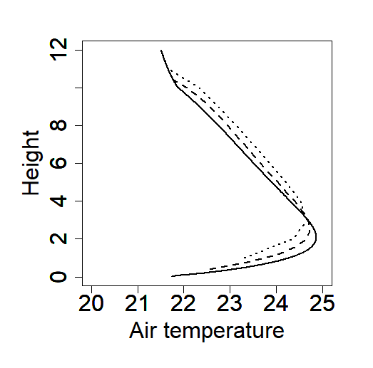
One can see that 
## Above canopy model
In contrast to below canopy, above canopy conditions are much simpler to derive. The easiest way to run the above canopy model is to use the same R wrapper function for the underlying c++ code as for below canopy. One need only specify `reqhgt` to be above canopy:

```{r eval=FALSE}
# Run model for a year dividing canopy into 10 layers
# Takes ~4 seconds
st<-Sys.time()
mout <- runpointmodel(climdata, reqhgt = 11, forestparams, paii = NA,  groundparams, lat =49.96807, long= -5.215668, n = 1000)
ed<-Sys.time()
ed-st
tme<-as.POSIXct(climdata$obs_time)
plot(mout$tair ~ tme, type="l", xlab = "Month", ylab = "Air emperature")
```
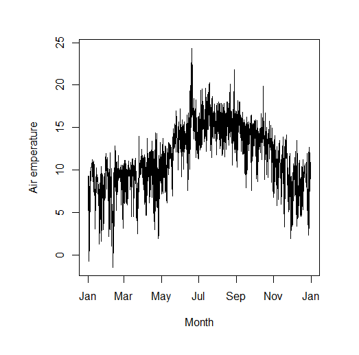

Here the number of layer becomes irrelevant and the model runs in a fraction of a second even with 1000 layers.

## Below-ground model
Implicit in the de Vries & van Wijk (1963) method used for calculating ground heat fluxes, is the assumption that temperatures at greater depths in ground exhibit dampened diurnal and annual cycle and that the phase shift of these cycles is shifted such that peaks occur later. The extent of this dampening and phase shift are determined by the thermal properties of the soil, specifically the heat capacity and thermal conductvity, which in turn are determined by the physical properties and water content. Tested against a full multi-layer soil model, a much simpler approach in which sub-surface temperatures are calculated as a backwards rolling-mean of surface temperatures performs remarkably well. The period over which to calculate this rolling mean can be derived theoretically and is depended upon on the depth for which temperatures are required as well as the thermal properties of the soil. Tis is the method implemented in micropoint,        

The below-ground model is run simply by setting `reqhgt` as negative. In the example below, Here we show how depth affects the amplitude and phase shift of temperature cycles.

```{r eval=FALSE}
paii <- PAIgeometry(PAI = 1, skew = 4, spread = 70, n = 20)
# run model for height mid-way to canopy top (6 cm above ground)
mout1 <- runpointmodel(climdata, reqhgt = 0, vegparams, paii,  groundparams, lat = 49.96807, long = -5.215668)
mout2 <- runpointmodel(climdata, reqhgt = -0.05, vegparams, paii,  groundparams, lat = 49.96807, long = -5.215668)
mout3 <- runpointmodel(climdata, reqhgt = -0.5, vegparams, paii,  groundparams, lat = 49.96807, long = -5.215668)
tme <- as.POSIXct(climdata$obs_time)
plot(mout1$tground ~ tme, type = "l", ylim = c(-5, 40), col = rgb(1, 0, 0, 0.5), xlab = "Month", ylab = "Temperature")
par(new = TRUE)
plot(mout2$tground ~ tme, type = "l", ylim = c(-5, 40), col = rgb(0, 0, 0, 0.5), lwd = 2, xlab = "", ylab = "")
par(new = TRUE)
plot(mout3$tground ~ tme, type = "l", ylim = c(-5, 40), col = rgb(0, 0, 1, 0.5), lwd = 3, xlab = "", ylab = "")
```
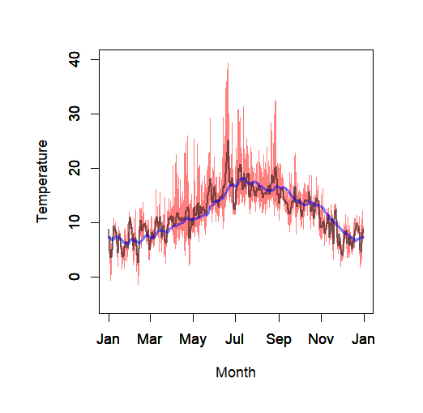
## Model outputs
Although the examples presented thus far focus predominantly on temperature, a number of other microclimate variables are returned, which may be useful for subsequent applications such modelling the body temperature of ectotherms. The variables returned differ depending on whether `reqhgt` is above or below canopy, at the ground surface or below ground.

### Above canopy
The following variables are returned, all of conditions at height `reqhgt` (except for average canopy temperature). The downward flux density of direct radiation is perpendicular to the solar beam rather than on the horizontal. The upward shortwave flux is assumed entirely diffuse. 

+-----------------------------------------------------------------------------+
|Model outputs.                                                               |
+-----------------------------------------------------------------------------+

+------------+------------------------------------------------+---------------+
| *Variable* | *Description*                                  | *Units*       |
+============+================================================+===============+
| obs_time   | Date and time in UTC (Posixlt format)          |Posixlt format |
+------------+------------------------------------------------+---------------+
| tair       | Air temperature                                |	$^\circ$C     |
+------------+------------------------------------------------+---------------+
| tcanopy    | Average canopy temperature                     | $^\circ$C     |
+------------+------------------------------------------------+---------------+
| relhum     | Relative humidity                              | %             |
+------------+------------------------------------------------+---------------+
| windspeed  | Wind speed                                     | $ms{-1}$      |
+------------+------------------------------------------------+---------------+
| Rdirdown   | Downward flux of direct beam radiation         | $Wm^{-2}$     |
+------------+------------------------------------------------+---------------+
| Rdifdown   | Downward flux of diffuse radiation             | $Wm^{-2}$     |
+------------+------------------------------------------------+---------------+
| Rlwdown    | Downward flux of longwave (thermal) radiation  | $Wm^{-2}$     |
+------------+------------------------------------------------+---------------+
| Rswup      | Upward flux of shortwave (diffuse) radiation   | $Wm^{-2}$     |
+------------+------------------------------------------------+---------------+
| Rlwup      | Upward flux of shortwave (diffuse) radiation   | $Wm^{-2}$     |
+------------+------------------------------------------------+---------------+

### Below canopy
The following variables are returned, all of conditions at height `reqhgt`. The downward flux density of direct radiation is perpendicular to the solar beam rather than on the horizontal. The upward shortwave flux is assumed entirely diffuse. 

+-----------------------------------------------------------------------------+
|Model outputs.                                                               |
+-----------------------------------------------------------------------------+

+------------+------------------------------------------------+---------------+
| *Variable* | *Description*                                  | *Units*       |
+============+================================================+===============+
| obs_time   | Date and time in UTC (Posixlt format)          |Posixlt format |
+------------+------------------------------------------------+---------------+
| tair       | Air temperature                                |	$^\circ$C     |
+------------+------------------------------------------------+---------------+
| tleaf      | Leaf temperature                               | $^\circ$C     |
+------------+------------------------------------------------+---------------+
| relhum     | Relative humidity                              | %             |
+------------+------------------------------------------------+---------------+
| windspeed  | Wind speed                                     | $ms{-1}$      |
+------------+------------------------------------------------+---------------+
| Rdirdown   | Downward flux of direct beam radiation         | $Wm^{-2}$     |
+------------+------------------------------------------------+---------------+
| Rdifdown   | Downward flux of diffuse radiation             | $Wm^{-2}$     |
+------------+------------------------------------------------+---------------+
| Rlwdown    | Downward flux of longwave (thermal) radiation  | $Wm^{-2}$     |
+------------+------------------------------------------------+---------------+
| Rswup      | Upward flux of shortwave (diffuse) radiation   | $Wm^{-2}$     |
+------------+------------------------------------------------+---------------+
| Rlwup      | Upward flux of shortwave (diffuse) radiation   | $Wm^{-2}$     |
+------------+------------------------------------------------+---------------+

### Ground surface
The following variables are returned, all of conditions at the ground surface. The downward flux density of direct radiation is perpendicular to the solar beam rather than on the horizontal. The upward shortwave flux is assumed entirely diffuse. The fractional water content is for the average top 10 cm of soil and is not depth specific.

+-----------------------------------------------------------------------------+
|Model outputs.                                                               |
+-----------------------------------------------------------------------------+

+------------+------------------------------------------------+---------------+
| *Variable* | *Description*                                  | *Units*       |
+============+================================================+===============+
| obs_time   | Date and time in UTC (Posixlt format)          |Posixlt format |
+------------+------------------------------------------------+---------------+
| tground    | Ground surface temperature                     |	$^\circ$C     |
+------------+------------------------------------------------+---------------+
| soilm      | Fractional water content of soil               | $m^3/m^3$     |
+------------+------------------------------------------------+---------------+
| Rdirdown   | Downward flux of direct beam radiation         | $Wm^{-2}$     |
+------------+------------------------------------------------+---------------+
| Rdifdown   | Downward flux of diffuse radiation             | $Wm^{-2}$     |
+------------+------------------------------------------------+---------------+
| Rlwdown    | Downward flux of longwave (thermal) radiation  | $Wm^{-2}$     |
+------------+------------------------------------------------+---------------+
| Rswup      | Upward flux of shortwave (diffuse) radiation   | $Wm^{-2}$     |
+------------+------------------------------------------------+---------------+
| Rlwup      | Upward flux of shortwave (diffuse) radiation   | $Wm^{-2}$     |
+------------+------------------------------------------------+---------------+

### Below ground
The following variables are returned. Temperature is for depth `reqhgt` below ground. The fractional water content is for the average top 10 cm of soil and is not depth specific.

+-----------------------------------------------------------------------------+
|Model outputs.                                                               |
+-----------------------------------------------------------------------------+

+------------+------------------------------------------------+---------------+
| *Variable* | *Description*                                  | *Units*       |
+============+================================================+===============+
| obs_time   | Date and time in UTC (Posixlt format)          |Posixlt format |
+------------+------------------------------------------------+---------------+
| tground    | Ground surface temperature                     |	$^\circ$C     |
+------------+------------------------------------------------+---------------+
| soilm      | Fractional water content of soil               | $m^3/m^3$     |
+------------+------------------------------------------------+---------------+

## Snow
The snow model is forthcoming.
